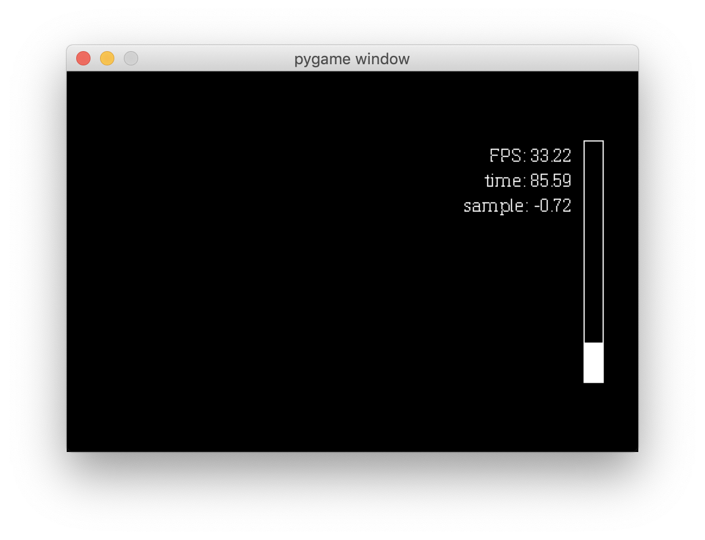
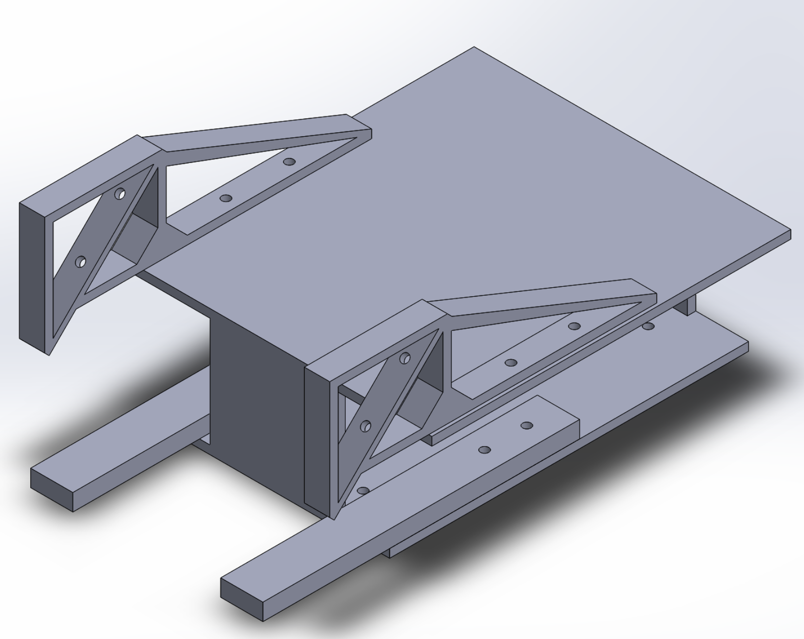
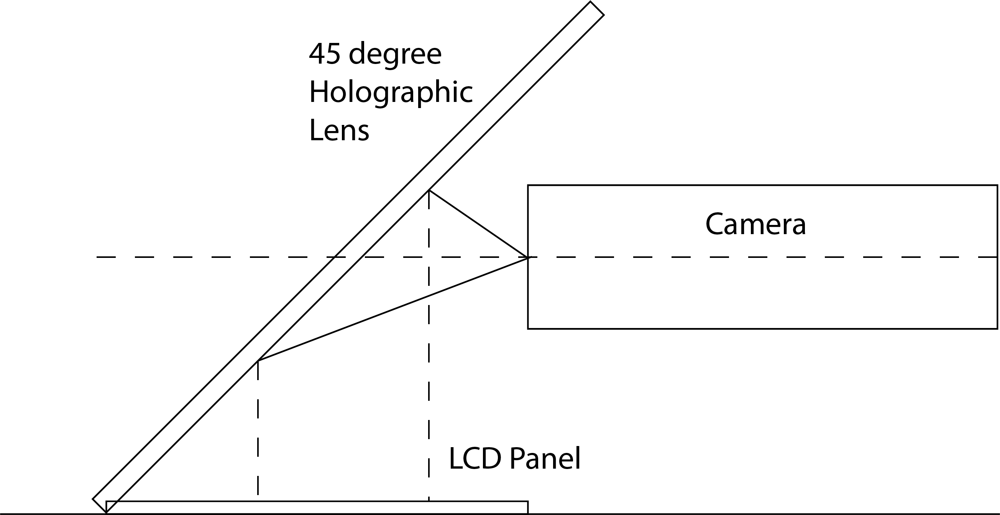

# Boilerbot: Head Up Display Module(HUD)

This is the repository for robomaster club electrical team's Head Up Display Project

## Overview

This project aims at using holographic film and LCD panel to add another layer of information
to operators' camera feed, including but not limited to the following:

1. Super capacitor status
   1. Current super capacitor voltage
   2. Boosting time info
2. Board sensor values
3. Enemies' positions on screen and off screen
4. Aim scope

Current GUI Prototype

Current Hardware design

Model of HUD

GUI Design

## Maintainers

[William](https://purduerobomaster.slack.com/team/UCNH7S52P)

## Version 3 Update
1. Screen
    1. ~~Color LCD without back light~~
        1. Not transparent
    2. ~~Liquid Crystal without back light~~
        1. Unable to find
    3. Sparkfun Transparent LCD
        4. Place vertically in front of camera to avoid light reflection and unnecessary blocking
    4. Traditional reflection design
    5. TFT screen + camera feed
        1. Place screen in front of VTM camera and use another camera to capture the view behind the LCD
1. Display
    1. Increase font size
    1. Choose thicker font
1. Version 2 Testing result
    1. 3D printed structure block view
    2. Reflection light interfere with view
    3. Blurred text display

## Version 2 Update

1. Code
    1. Performance
        1. 30+ fps on Macbook Pro 2017
    1. [ ] Data Communication
        1. Threading Reading
            1. [x] Use another thread for serial data reading
            1. Use Lifoqueue to store serial data and ensure data validity
            1. Extend Packetizer class in pyserial for customized data communication
                1. Possibly C struct or object stream [Ref](https://docs.python.org/3/library/struct.html)
        1. C Struct packing and unpacking
            1. Use C Struct to transmit data between components
            1. Mind endian
                1. Though arduino and pi should both be little endian
                1. can use `sys.byteorder` to check for endian
    1. [ ] Auto start script
2. Hardware
    1. Mainly use triangles to improve structure strength
    1. Use 5mm organic glass to protect reflective film

## Version 1

1. Preparation
   1. Code
      1. [x] Test display of LCD on Pi
         1. ~~[Spidev](http://github.com/doceme/py-spidev)~~
         2. [pygame](https://www.pygame.org/docs)
         3. [pySerial](https://pyserial.readthedocs.io/en/latest/shortintro.html)
      2. [ ] Determine serial communication data strcutre
         1. [ ] [Super Capacitor Booster embedded system](https://github.com/RoboMaster-Club/Super-Capacitor-Booster)
         2. [ ] Custom Power distribution Unit
         3. [ ] TX 2 / STM32 Maincontroller?
   2. Hardware
      1. [x] Measure camera specs and installation position specs 
      2. [x] LCD dimension measurement
      3. [x] Reflective Film Testing
2. Development
   1. Code
      1. [x] Display
         1. [ ] Super Capacitor
            1. Boosting Strip display
            2. Boosting time calculation and display
            3. Voltage display
         2. [x] Sensor info
         3. [ ] Enemy Identification
            1. Box drawing on enemies
            2. Triangles indication of enemies around
         4. [ ] Aim scope
      2. [x] Data communication
         1. [ ] Serial Communication Class
         2. [ ] [Super Capacitor Booster embedded system](https://github.com/RoboMaster-Club/Super-Capacitor-Booster)
            1. [ ] Raw data reading
            2. [ ] Data processing
            3. [ ] Better transmission speed
               1. Serialize object? between python and c
               2. ~~Rewrite in C~~
         3. [ ] Custom Power distribution Unit
            1. Raw data reading
            2. Data processing
         4. [ ] TX 2 / STM32 Maincontroller
            1. Raw data reading
            2. Data processing
   2. Hardware
      1. [x] Shell support design
      2. [x] Shell printing and testing

## Info
1. The player display is 1920 x 1080 (16:9)
2. The LCD panel is 480 x 320 pixels (3:2)
3. Use the ratio 1080:320 ~= 2.5 for GUI development
   1. Boost Strip
      1. 25 px *  150 px
      2. (255, 0, 0, 50)
4. `/dev/ttyS0` is the serial port name on raspberry pi zero w
5. Need to disable serial console and enable uart prior to executing the program