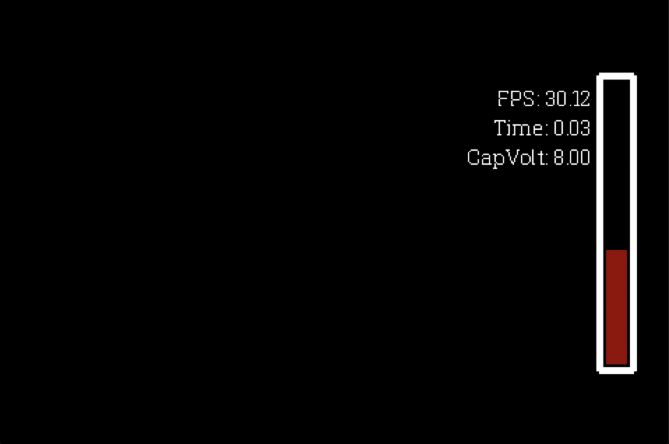

# Boilerbot: Head Up Display Module(HUD)

This is the repository for robomaster club electrical team's Head Up Display Project

## Overview

This project aims at using holographic film and LCD panel to add another layer of information
to operators' camera feed, including but not limited to the following:

1. Super capacitor status
   1. Current super capacitor voltage
   2. Boosting time info
2. Board sensor values
3. Enemies' positions on screen and off screen
4. Aim scope

Model of HUD

GUI Design

Current GUI Prototype

## Maintainers

[William](https://purduerobomaster.slack.com/team/UCNH7S52P)

## Todos

1. Preparation
   1. Code
      1. [ ] Test display of LCD on Pi
         1. ~~[Spidev](http://github.com/doceme/py-spidev)~~
         2. [pygame](https://www.pygame.org/docs)
         3. [pySerial](https://pyserial.readthedocs.io/en/latest/shortintro.html)
      2. [ ] Determine serial communication data strcutre
         1. [ ] [Super Capacitor Booster embedded system](https://github.com/RoboMaster-Club/Super-Capacitor-Booster)
         2. [ ] Custom Power distribution Unit
         3. [ ] TX 2 / STM32 Maincontroller?
   2. Hardware
      1. [x] Measure camera specs and installation position specs 
      2. [ ] LCD dimension measurement
      3. [ ] Reflective Film Testing
2. Development
   1. Code
      1. [ ] Display
         1. [ ] Super Capacitor
            1. [ ] Boosting Strip display
               1. [ ] RGB Support :)
               2. [ ] User Friendly
            2. [ ] Boosting time calculation and display
            3. [ ] Voltage display
         2. [ ] Sensor info
         3. [ ] Enemy Identification
            1. [ ] Box drawing on enemies
            2. [ ] Triangles indication of enemies around
         4. [ ] Aim scope
      2. [ ] Data communication
         1. [ ] [Super Capacitor Booster embedded system](https://github.com/RoboMaster-Club/Super-Capacitor-Booster)
            1. [ ] Raw data reading
            2. [ ] Data processing
         2. [ ] Custom Power distribution Unit
            1. [ ] Raw data reading
            2. [ ] Data processing
         3. [ ] TX 2 / STM32 Maincontroller
            1. [ ] Raw data reading
            2. [ ] Data processing
   2. Hardware
      1. [ ] Shell support design
      2. [ ] Shell printing and testing

## Info
1. The player display is 1920 x 1080 (16:9)
2. The LCD panel is 480 x 320 pixels (3:2)
3. Use the ratio 1080:320 ~= 2.5 for GUI development
   1. Boost Strip
      1. 25 px *  150 px
      2. (255, 0, 0, 50)